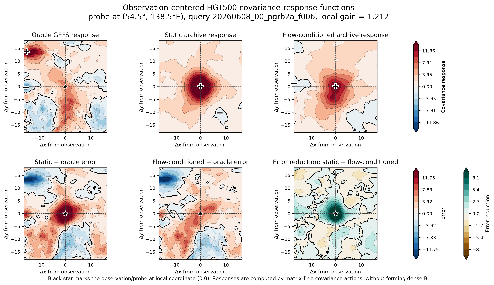
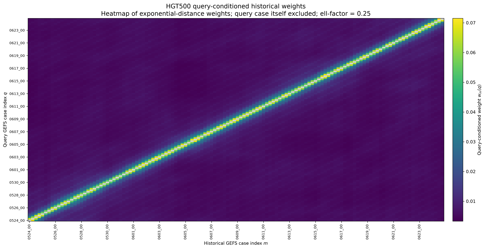

# Scalable Climate-AI Ensemble Evaluation

This repository contains template HPC workflows for evaluating AI-generated or
historical atmospheric ensembles using data-assimilation-facing diagnostics.

The central idea is to evaluate ensemble spread and localized covariance-response
structure without forming dense covariance matrices. The examples use
matrix-free ensemble covariance actions, query-conditioned historical weighting,
and SLURM job templates for scalable execution on HPC systems.

## What this repository demonstrates

- SLURM-based climate-AI workflows on HPC systems
- Matrix-free ensemble covariance-response diagnostics
- Observation-centered covariance-response visualization
- Query-conditioned historical weighting for flow-dependent covariance response
- Spread and covariance evaluation templates for GEFS/GEOS-style ensembles

## Main idea

Given ensemble perturbations

```math
X = [x_1-\bar{x}, \ldots, x_{N_e}-\bar{x}],
```

the ensemble covariance action can be evaluated as

```math
Bv = X(X^\top v)/(N_e-1),
```

without forming the dense covariance matrix \(B\). This makes localized
covariance-response diagnostics feasible for high-dimensional atmospheric states.

## Repository structure

```text
configs/   Example configuration files
docs/      Short method notes
scripts/   Python scripts for covariance-response and weight diagnostics
slurm/     Portable SLURM job templates
figures/   Example figures, if provided
```

## Notes

This repository contains cleaned templates only. It does not include restricted
datasets, model checkpoints, private paths, internal logs, or collaborator data.

## Example outputs

### Observation-centered covariance response



### Query-conditioned historical weights


